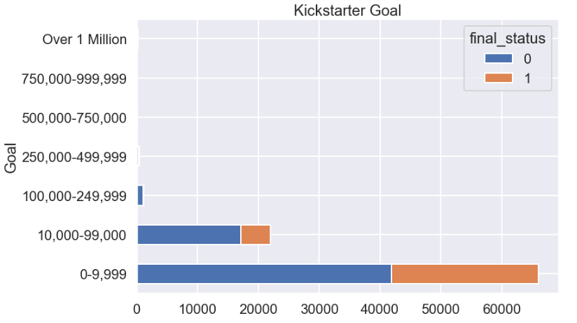
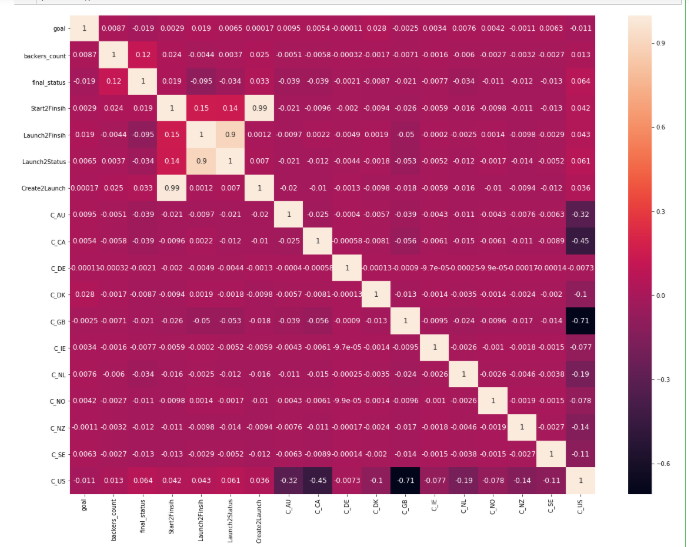

# Data Science Kickstarter Success Rate: Project Overview

* Created a tool that estimates the success rate of the Kickstarter funding project to help an entrepreneur achieve a successful campaign.
* Optimised Linear, DecisionTree, and Random Forest Regression using GridsearchCV to reach the best model.
* Built a client-facing API using flask and Heroku to view that on the web.

# Code and Resources Used

**Python Version**: 3.7

**Packages**: pandas, numpy, sklearn, matplotlib, seaborn, flask, json, pickle

**For Web Framework Requirements**: pip install -r requirements.txt

**Flask and Heroku Production**: https://towardsdatascience.com/designing-a-machine-learning-model-and-deploying-it-using-flask-on-heroku-9558ce6bde7b

# Data Cleaning and EDA
After downloading the data, I needed to clean it up so that it was usable for our model. I made the following changes and created the following variables:

Transformed Unix date to GMT date

Added a new column for the time between created and the deadline date - also launched to deadline date 

Changing date types 

   

  

# Insight 

US,GB and Canada are most likely to back the Kickstarter Projects.

Project under $10,000 are not only more likely to be backed but also has a higher chance of achieving their goal.

# Model Building 
First, I transformed the categorical variables into dummy variables. I also split the data into train and test sets with a test size of 20%.

I tried four different models and evaluated them using Precision, Recall and confusion matrix. I chose the confusion matrix because it is relatively easy to interpret.

I tried four different models:

Linear Logistic – Baseline for the model

Decision Tree and Kneighborsclassifier 

Random Forest – Again, with the sparsity associated with the data, I thought that this would be a good fit.

# Model Performance
The Random Forest model far outperformed the other approaches on the test and validation sets.

Random Forest :
Accurary score of 85.7% on Testing Data. 
Accurary score of 86.9% on Training Data. 

# Production 
In this step, I built a flask API endpoint that was hosted on a local web server by following along with the TDS tutorial in the reference section above. The API endpoint takes in a request with a list of values from a Kickstarter listing and returns a success rate.

https://kickstarter001.herokuapp.com/

